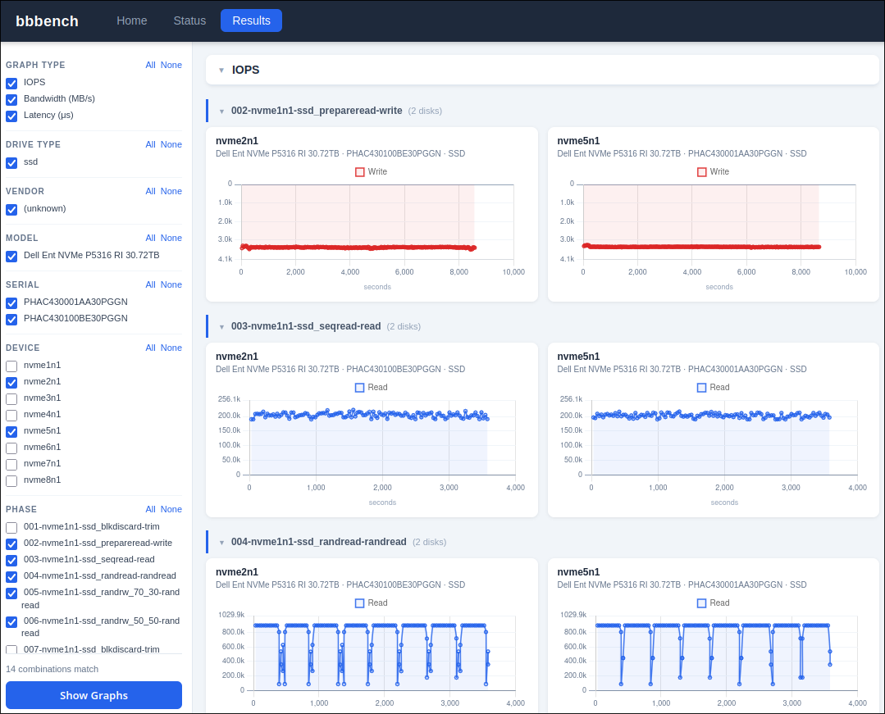
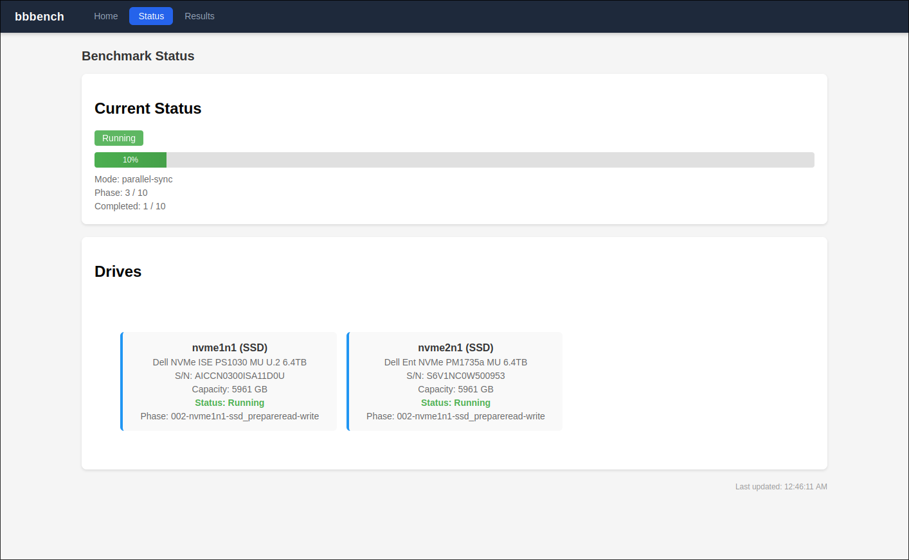
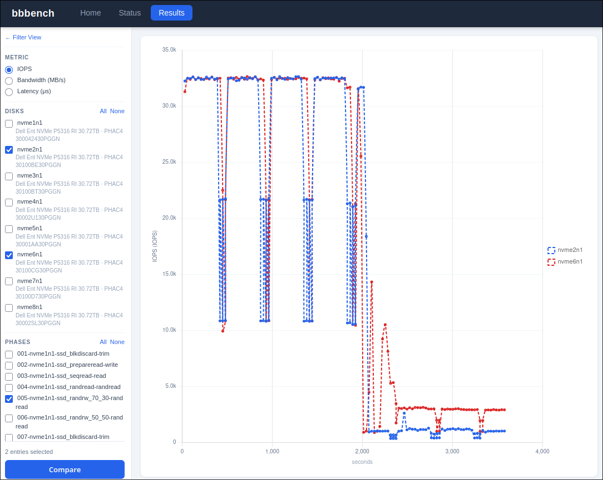

# Web UI

The `bbbench serve` command (also started automatically by `orchestrator` during a run) exposes a web interface on `http://0.0.0.0:12345` by default.

## Benchmark Status

The **Status** page shows live progress while `orchestrator` is running.

- **Current Status** — running/idle indicator, overall progress bar, current phase number, and completed phase count.
- **Drives** — one card per benchmarked drive showing model, serial, capacity, current status, and active phase name.

The page auto-refreshes so you can monitor a long run without manually reloading.

## Graphs and Navigation

The **Results** page lets you explore time-series charts from a completed (or in-progress) run.

The left sidebar provides filters that update the displayed graphs in real time:

| Filter | Description |
|--------|-------------|
| **Graph Type** | Toggle IOPS, Bandwidth (MB/s), and Latency (µs) charts independently. |
| **Drive Type** | Narrow down to HDD or SSD results. |
| **Vendor / Model / Serial** | Select specific hardware identities. |
| **Disk** | Choose which drives to include. |
| **Phase** | Select one or more benchmark phases (e.g. `seqread`, `randread-randread`). |

Each matching combination of disk × phase is rendered as its own graph card. Click a card to maximize it; press **Esc** to return to the grid.

## Comparing Disks on the Same Graph

The **Compare** view overlays multiple disks on a single chart, making it easy to spot performance differences.

Select two or more drives in the sidebar, choose a phase, then click **Compare**. Each drive is drawn in a distinct color with a legend. Metric, phase, and time axis are shared so curves are directly comparable.
